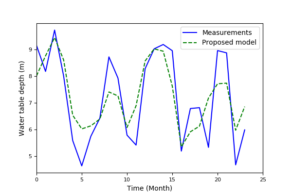

# LSTM based Model for Water Table Depth Prediction

### Introduction
This is a Theano implementation of our work *Developing a Long Short-Term Memory (LSTM) based Model for Predicting Water Table Depth in Agricultural Areas*. [[Paper](https://www.sciencedirect.com/science/article/pii/S0022169418303184)]

**NEW: PyTorch implementation also available: [Water-Table-Depth-Prediction-PyTorch]https://github.com/jfzhang95/Water-Table-Depth-Prediction-PyTorch)!**

### Requirements
```
Python3.x
theano>=1.0.1
numpy>=1.14.0
pandas>=0.22.0
scikit-learn>=0.14
```
### Installation
The code was tested with Python 3.5. To use this code, please do:


0. Clone the repo:
    ```Shell
    git clone https://github.com/jfzhang95/LSTM-water-table-depth-prediction.git
    cd LSTM-water-table-depth-prediction
    ```
 
1. Install dependencies:
    ```Shell
    pip install theano matplotlib numpy pandas scikit-learn
    ```    
  
2. To try the demo code, please run:
    ```Shell
    python demo.py
    ```

If installed correctly, the result should look like this:


Noted that the demo data ([demo.csv](https://github.com/jfzhang95/LSTM-water-table-depth-prediction/blob/master/data/demo.csv)) are processed manually,  so they are not real data, but they still can reflect the correlation between the original data.

### Tutorials
A model training and testing pipeline can be defined as:
 
```python
def LSTM_FC_prediction(X, Y, X_test=None, iters=20000, learning_rate=1e-4, dropout_prob=0.5):
    if dropout_prob > 1. or dropout_prob < 0.:
        raise Exception('Dropout level must be in interval [0, 1]')
    num_month = Y.shape[0]
    input_shape = X.shape[1]
    model = LSTM_FC_Model(num_input=input_shape, num_hidden=[40], num_output=1)
    print('Start training......')
    for iter in range(iters + 1):
        loss = model.fit(X, Y, learning_rate, dropout_prob)
        if iter % 1000 == 0:
            print("iteration: %s, loss: %s" % (iter, loss))
    # Saving model
    model.save_model_params('checkpoints/LSTM_FC_CKPT')

    print('Start predicting......')
    Y_test = model.predict(X_test)
    print('Done.')
    return Y_test
```
For more details, please see in [tuitorials](https://github.com/jfzhang95/LSTM-water-table-depth-prediction/blob/master/tutorials.ipynb).

### Citation
If you think our code is useful, please consider citing the following paper:

	@article{zjf18,
	  journal        = {Journal of Hydrology},
	  title          = {Developing a Long Short-Term Memory (LSTM) based Model for Predicting Water Table Depth in Agricultural Areas},
	  author         = {J.F. Zhang, Y. Zhu, X.P. Zhang, M. Ye, J.Z. Yang},
	  year           = {2018},
	  volume         = {561},
	  pages          = {918-929}
	}

### License
[MIT](https://github.com/jfzhang95/LSTM-water-table-depth-prediction/blob/master/LICENSE)

